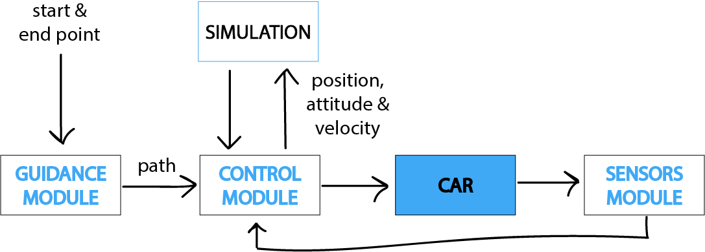

#  Autonomous Car - Laboratory Assignment Repository
Solution to the Laboratory Assignment 2 submitted in partial fulfillment of the requirements for the course in Robotics 2022/2023 at Instituto Superior Técnico - Lisbon University.

# Abstract
This paper presents a comprehensive study of various key components required for autonomous vehicles, specifically focusing on self-driving cars. The study covers aspects of path planning, computer vision, localization, and control systems. The path planning is done through the use of the Pure Pursuit algorithm while the localization is done through a combination of computer vision and sensor fusion. The sensor fusion is achieved through the use of an Extended Kalman Filter (EKF), which fuses data from various sensors to provide an accurate estimate of the vehicle's orientation and position. The control systems are responsible for controlling the vehicle's actuators and ensuring smooth navigation of the vehicle. The study provides a detailed overview of each component and how they work together to enable autonomous driving. The findings of this study can be used to inform the development of self-driving cars and other autonomous vehicle systems.
## Keywords
Autonomous vehicles, Self-driving cars, Path planning, Computer vision, Localization, Control systems,  Pure Pursuit, Sensor fusion, Extended Kalman Filter

# System Overview
